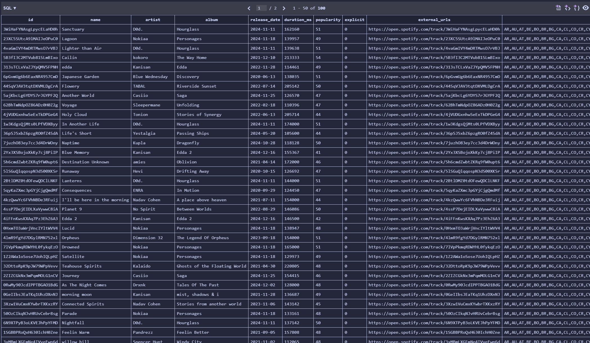

# Spotify playlist ETL pipeline
Command line interface program that...
1) accepts a Spotify playlist URL
2) extracts the first 100 songs using the spotipy Python library (Spotify API limit) 
3) transforms the data to only include relevant information such as id, name, artist, album, release date, duration in ms, popularity, explicit tag, url, and available markets
4) creates and loads data into sqlite database using sqlite3 python library

# credentials.txt format
SPOTIPY_CLIENT_ID = your_client_id 
SPOTIPY_CLIENT_SECRET = your_client_secret

# Example
